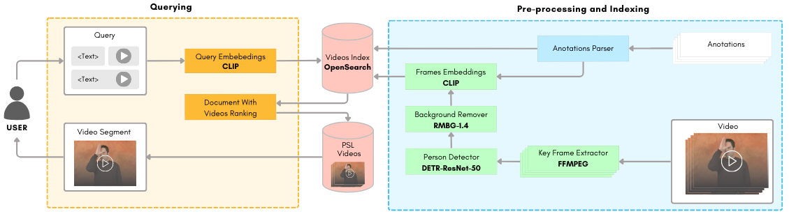

# VideoLGP



This is the official GitHub repo for the paper "VideoLGP: A Sign Language Video Moment Retrieval Open Framework".

## What is VideoLGP

VideoLGP is a video moment retrieval software for Portuguese Sign Language videos focusing on signs where facial expressions have a big role. A collection of five hours of annotated Portuguese Sign Language videos is used as the dataset, where it generates a series of embeddings from the extracted video frames to allow the user to use a text query to search for a specific video segment. In this repository, there are only three videos taken into account. 

This system also includes a web application developed in Flask that allows the users to try VideoLGP.

## How to use VideoLGP
### In the deployed web application

You just need to access this link: https://videolgp.novasearch.org/

In this deployed version, the model that is being used to generate embeddings is the `clip-ViT-B-32`.
### Locally

To run VideoLGP in your system, first, you need to clone this repository:

```sh
git clone TODO
```

Then, you must install all the needed dependencies through pip:

```sh
pip install -r requirements.txt
```

After this, run the `preprocess.sh` script to do all the pre-processing needed to execute the application correctly.

When the pre-processing phase is finished, just execute the Flask run command:

```sh
flask --app app run
```

You can also run in debug mode:

```sh
flask --app app --debug run
```

And choose the address and port to run on:

```sh
flask --app app run -h X.X.X.X -p XXXX
```
## Folder Structure
#### `eaf_parser`
This folder contains the script responsible for parsing the **EAF** files
- `eaf_parser.py`: Iterates through the available EAF files (one for each annotated video), parses the relevant info into JSON files and creates the video captions files

#### `embeddings`
This folder contains the scripts responsible for generating embeddings for text and image
- `embeddings_generator.py`: Has the functions responsible for generating embeddings for text and images. This is where the embedding generator model is defined
- `embeddings_processing.py`: Iterates through the extracted video frames and generates its embeddings. Also contains the function to generate the user's query embeddings

#### `frame_extraction`
This folder contains the scripts responsible for extracting and cropping the video frames
- `frame_extraction.py`: Iterates through the videos and respective annotations and extracts the frames where is being performed a sign in which the facial expression has a big role and one frame for each phrase
- `object_detector.py`: Has the functions responsible for cropping and removing the background of the extracted frames to only have the person. This is where the cropping and background removal models are defined

#### `opensearch`
This folder contains the script responsible for the OpenSearch index
- `opensearch.py`: Contains the functions that create the OpenSearch index, manage its documents and query the index

#### `static`
This folder contains the video-related files and the CSS file
- `videofiles`: Contains the EAF files, the MP4 videos, the extracted frames, the parsed annotations' files and the video captions
- `style.css`: CSS script that defines the look and formatting of the web pages

#### `templates`
This folder contains the HTML files for the web application

#### `_init_.py`
This script initializes the Flask web application

#### `preprocess.py`
This script is responsible for all the pre-processing tasks before starting the application, such as parsing the annotations files, extracting the relevant frames, generating the embeddings and indexing in OpenSearch

#### `query.py`
This script handles the user queries and displays its results in the web application.

## Cite us
If you use our code in your scientific work, please cite us!

```bibtex
@inproceedings{VideoLGP,
  author       = {Gonçalo Martins and
                  Afonso Quinaz and
                  João Magalhães},
  title        = {VideoLGP: A Sign Language Video Moment Retrieval Open Framework},
  booktitle    = {TODO},
  doi          = {TODO}
  publisher    = {TODO},
  year         = {2024}
}
```
